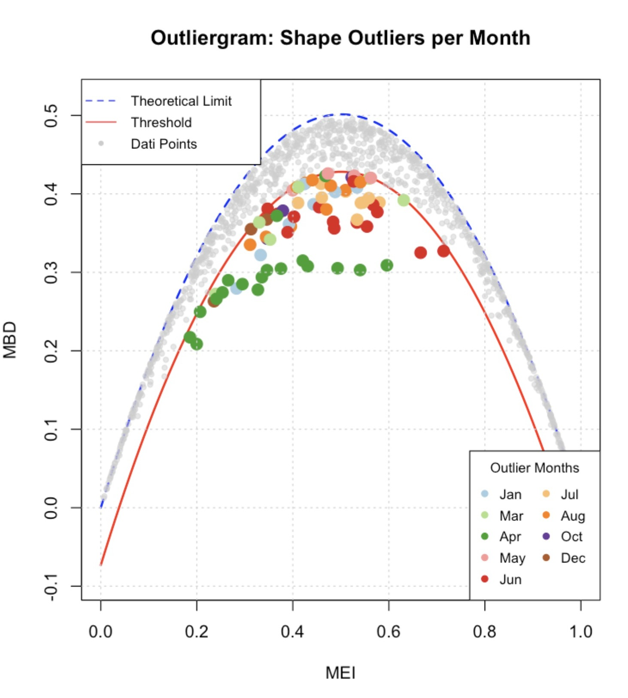
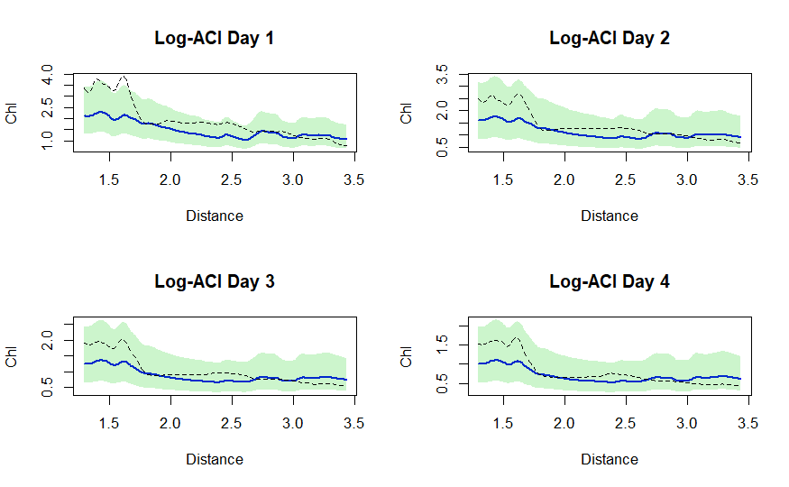
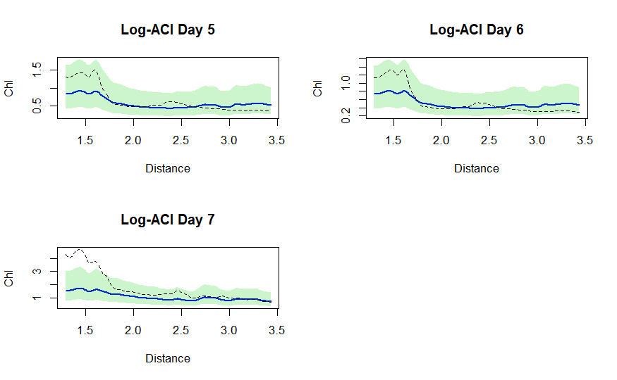

# 🌊 Chlorophyll Forecasting in the Northern Adriatic Sea
**Non-parametric Statistics 2025-2026 Project**

This project aims to develop a data-driven predictive tool to provide reliable short-term forecasts (up to 7 days) regarding water transparency and the risk of algal/mucilage aggregation along the Northern Adriatic coast. The target variable used to estimate algal biomass is **Chlorophyll-a** concentration ($mg/m^3$).

## 📁 Repository Structure

- **`code/`**: The core scripts and notebooks for the project pipeline (other files in this directory can be safely ignored):
  - `dati_costa.R`: Handles data preprocessing, boundary extraction, and spatial linearization of the coastline.
  - `fda_coastline_NO_PO_PCA_AGGIUSTATA.R`: The main script for Functional Data Analysis, FPCA dimensionality reduction, and Time-Series forecasting.
  - `ConformalPrediction.Rmd` (and its output `ConformalPrediction.html`): R Markdown notebook dedicated to Uncertainty Quantification via Adaptive Conformal Inference (ACI).
- **`images/`**: Charts, diagrams, and visualizations generated during the various phases of the analysis.
- **`Report Latex/`**: LaTeX sources containing the final report and formal project details (`main.tex`).
- **`final presentation.pdf`**: Slide deck offering a high-level, visual summary of the project's methodology and results.

## 🔬 Methodology and Models

The project tackles the complex challenge of marine spatiotemporal forecasting by combining **Functional Data Analysis (FDA)** with advanced **Time-Series Forecasting** models.

### 1. Functional Data Engineering
The 2D geometry of the Northern Adriatic coast was transformed into a 1D spatial domain (representing cumulative distance). We used **B-splines with Roughness Penalty** to extract continuous functional profiles from discrete satellite and oceanographic measurements, effectively filtering out noise.

### 2. Functional Outlier Detection
To identify extreme algal bloom events and analyze their temporal frequency, the project implements two anomaly detection techniques: the **Functional Boxplot** for global magnitude anomalies (extreme chlorophyll levels across the entire coast) and the **Outliergram** for morphological shape anomalies (localized spikes diverging from the expected spatial gradient).

### 3. Dimensionality Reduction (FPCA)
To make forecasting computationally efficient, the continuous spatial profiles were compressed using **Functional Principal Component Analysis (FPCA)**. The analysis shows that the first 4 Principal Components account for approximately 96% of the total variance, allowing us to accurately reconstruct the behavior of the entire coast.

### 4. Forecasting and Model Comparison
Using the principal component scores, we tested and compared several time-series forecasting strategies: **VAR**, **VECM**, **XGBoost**, and **SARIMA**. 
The **VECM (Vector Error Correction Model)** emerged as the best-performing model (RMSE $\approx 0.22$). Tests demonstrated that the chlorophyll distribution dynamics share long-term stochastic trends, and the VECM successfully maintains the physical consistency of the North-South gradient throughout the entire 7-day window.

### 5. Uncertainty Quantification (Conformal Prediction)
Point forecasts were enriched with tolerance bands derived through **Adaptive Conformal Inference (ACI)** in the logarithmic domain. This non-parametric approach provides a rigorous "worst-case scenario" for algal risk (with 95% statistical reliability), yielding physically sound lower bounds (strictly positive) and adaptive bands that scale with the magnitude of the bloom.

